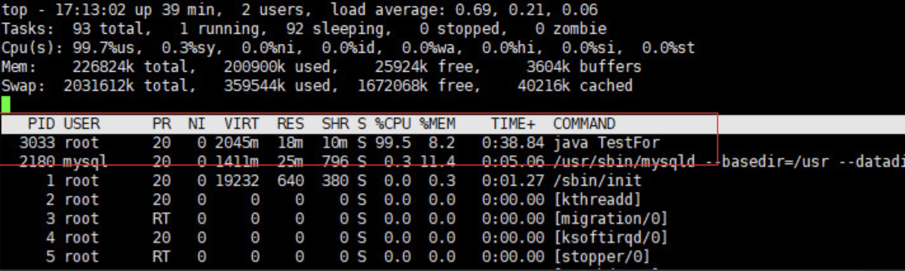
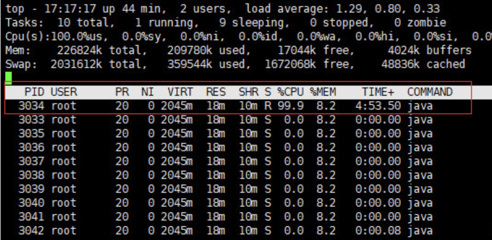
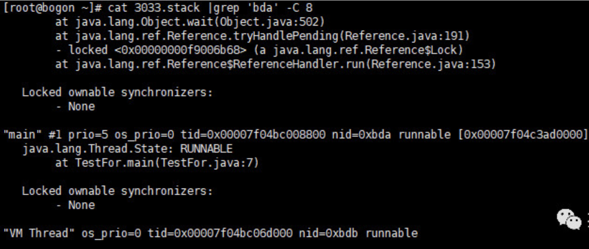

# 线上 CPU100%排查套路

- 查消耗 cpu 最高的进程 Pid
- 根据 Pid 查出消耗 cpu 最高的线程号
- 根据线程号查出对应的 java 线程，进行处理。

准备一行死循环代码

    public class TestFor {
        public static void main(String[] args) {
            int random = 0;
            while (random < 100) {
                random = random * 10;
            }
        }
    }

## Linux 版

> 查消耗 Cpu 最高的进程 PID

执行命令

- 执行 top -c ，显示进程运行信息列表。按下 P,进程按照 Cpu 使用率排序

如下图所示，PID 为 3033 的进程耗费 Cpu 最高

> 根据 Pid 查出消耗 Cpu 最高的线程号

执行命令

- top -Hp 3033 ，显示一个进程的线程运行信息列表。按下 P,进程按照 Cpu 使用率排序

如下图所示，PID 为 3034 的线程耗费 Cpu 最高

这是十进制的数据，转成十六进制为 0Xbda

根据线程号查出对应的 java 线程，进行处理

    jstack -l 3033 > ./3033.stack

然后执行，grep 命令，看线程 0xbda 做了什么

    cat 3033.stack |grep 'bda' -C 8

输出如下

