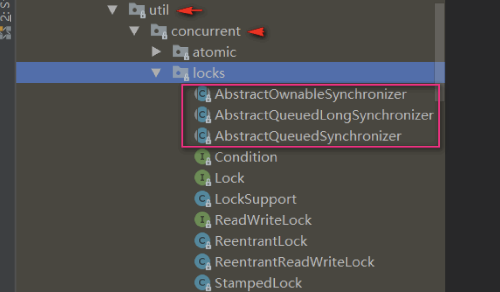
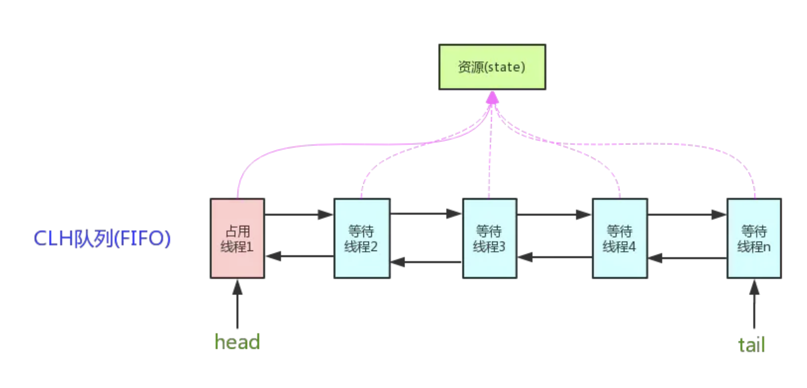

# AQS

lock 包下有三个抽象的类:

通常地：AbstractQueuedSynchronizer 简称为 AQS  
我们 Lock 之类的两个常⻅的锁都是基于它来实现的

## AQS 的核心思想

AQS 就是基于 CLH 队列，用 volatile 修饰共享变量 state，线程通过 CAS 去改变状态符，成功则获取锁成功，失败则进入等待队列，等待被唤醒。
CLH（Craig，Landin，and Hagersten）队列是一个虚拟的双向队列，虚拟的双向队列即不存在队列实例，仅存在节点之间的关联关系。

## AQS 实现

如图示，AQS 维护了一个 volatile int state 和一个 FIFO 线程等待队列，多线程争用资源被阻塞的时候就会进入这个队列。state 就是共享资源，其访问方式有如下三种：
getState();setState();compareAndSetState();

> AQS 定义了两种资源共享方式：

- Exclusive：独占，只有一个线程能执行，如 ReentrantLock
- Share：共享，多个线程可以同时执行，如 Semaphore、CountDownLatch、ReadWriteLock，CyclicBarrier

> 独占锁与共享锁的区别：

- 独占功能:
  当锁被头节点获取后，只有头节点获取锁，其余节点的线程继续沉睡，等待锁被释放后，才会唤醒下一个节点的线程。
- 共享功能:
  只要头节点获取锁成功，就在唤醒自身节点对应的线程的同时，继续唤醒 AQS 队列中的下一个节点的线程，每个节点在唤醒自身的同时还会唤醒下一个节点对应的线程，以实现共享状态的“向后传播”，从而实现共享功能。

## 细节

- AQS 其实就是一个可以给我们实现锁的框架
- 内部实现的关键是：先进先出的队列、state 状态
- 定义了内部类 ConditionObject
- 拥有两种线程模式
  - 独占模式
  - 共享模式
- 在 LOCK 包中的相关锁(常用的有 ReentrantLock、 ReadWriteLock)都是基于 AQS 来构建
- 一般我们叫 AQS 为同步器
