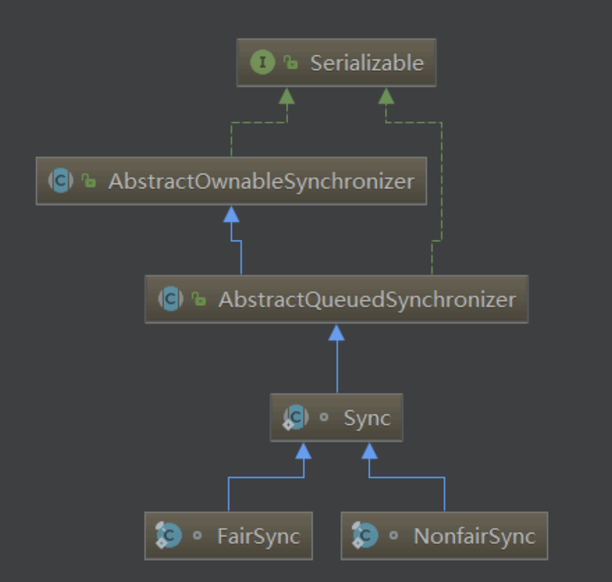

# synchronized 和 lock

> Java 多线程加锁机制

- Synchronized
- 显式 Lock

## Synchronized

synchronized 是 Java 的一个关键字，它能够将代码块(方法)锁起来

> 用法示例

    public synchronized void test() {
    }

> synchronized 是一种互斥锁一次

只能允许一个线程进入被锁住的代码块

> synchronized 是一种内置锁/监视器锁

Java 中每个对象都有一个内置锁(监视器,也可以理解成锁标记)，而 synchronized 就是使用对象的内置锁(监视器)来将代码块(方法)锁定的！ (锁的是对象，但我们同步的是方法/代码块)

> Synchronized 用处是什么？

- synchronized 保证了线程的原子性。(被保护的代码块是一次被执行的，没有任何线程会同时访问)
- synchronized 还保证了可⻅性。(当执行完 synchronized 之后，修改后的变量对其他的线程是可⻅的)

Java 中的 synchronized，通过使用内置锁，来实现对变量的同步操作，进而实现了对变量操作的原子性和其他线程对变量的可⻅性，从而确保了并发情况下的线程安全。

> Synchronized 原理

- 同步代码块：monitorenter 和 monitorexit 指令实现的
- 同步方法: 方法修饰符上的 ACC_SYNCHRONIZED 实现。

synchronized 底层是是通过 monitor 对象，对象有自己的对象头，存储了很多信息，其中一个信息标示是被哪个线程持有。

> 如何使用

- 修饰普通方法
  - 当前对象(内置锁)
- 修饰代码块
  - 当前对象(内置锁)
  - 其他的对象(随便一个对象都有一个内置锁)，解耦锁与当前对象的关系
- 修饰静态方法
  - 类锁(静态方法属于类方法，它属于这个类，获取到的锁是属于类的锁(类的字节码文件对象)）

Tip：

- 获取了类锁的线程和获取了对象锁的线程是不冲突的！
- 锁的持有者是“线程”，而不是“调用”。

## Lock 显示锁

- Lock 方式来获取锁支持中断、超时不获取、是非阻塞的
- 提高了语义化，哪里加锁，哪里解锁都得写出来
- Lock 显式锁可以给我们带来很好的灵活性，但同时我们必须手动释放锁
- 支持 Condition 条件对象
- 允许多个读线程同时访问共享资源

> Lock 锁主要的两个子类：

- ReentrantLock
- ReentrantReadWriteLock

## synchronized 锁和 Lock 锁使用哪个

- synchronized 好用，简单，性能不差
- 没有使用到 Lock 显式锁的特性就不要使用 Lock 锁了，要手动释放锁才行(如果忘了释放，这就是一个隐患)

所以说，我们绝大部分时候还是会使用 Synchronized 锁，用到了 Lock 锁提及的特性，带来的灵活性才会考虑使用 Lock 显式锁

## ReentrantLock 和 ReentrantReadWriteLock

### ReentrantLock

> 要点

- 比 synchronized 更有伸缩性(灵活)
- 支持公平锁(是相对公平的)和非公平锁的
- 互斥锁(一次只能有一个线程进入到临界区(被锁定的区域))
- 使用时最标准用法是在 try 之前调用 lock 方法，在 finally 代码块释放锁
- AQS 是 ReentrantLock 的基础，AQS 是构建锁、同步器的框架

### ReentrantReadWriteLock

是一个读写锁：

- 在读取数据的时候，可以多个线程同时进入到到临界区(被锁定的区域)
- 在写数据的时候，无论是读线程还是写线程都是互斥的

一般来说：我们大多数都是读取数据得多，修改数据得少。所以这个读写锁在这种场景下就很有用了！

> 要点

- 读锁不支持条件对象，写锁支持条件对象
- 读锁不能升级为写锁，写锁可以降级为读锁读
- 写锁也有公平和非公平模式
- 读锁支持多个读线程进入临界区，写锁是互斥

### 总结

- AQS 是 ReentrantReadWriteLock 和 ReentrantLock 的基础，因为默认的实现都是在内部类 Syn 中，而 Syn 是继承 AQS 的
- ReentrantReadWriteLock 和 ReentrantLock 都支持公平和非公平模式，公平模式下会去看 FIFO 队列线程是否是在队头，而非公平模式下是没有的
- ReentrantReadWriteLock 是一个读写锁，如果读的线程比写的线程要多很多的话，那可以考虑使用它。它使用 state 的变量高 16 位是读锁，低 16 位是写锁
- 写锁可以降级为读锁，读锁不能升级为写锁
- 写锁是互斥的，读锁是共享的。
