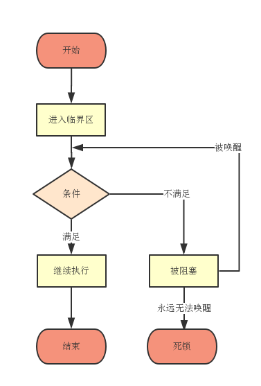

# 条件对象

> 临界区

在同步的程序设计中。临界区指的是一个訪问共用资源的程序片段，而这些共用资源又具有无法同一时候被多个线程訪问的特性。 当有线程进入临界区时，其它线程或是进程必须等待，在一些情况下必须在临界区的进入点与离开点採用一些特殊的方法。以确保这些共用资源是被相互排斥使用的。

> 为什么需要它

假如有一个转账线程进入了临界区，却发现转出账户的余额不足以转出足够的金额，这时候它应该等待其他线程向该账户转入足够的金额。
但是，该线程又获得了锁对象，其他线程无法再进行转账操作。这就是需要条件对象的原因。

有时候，线程获得锁进入临界区，却发现在满足某一条件后它才能执行。所以我们要用一个条件对象来管理那些已经获得了一个锁，但是却不能做有用工作的线程。

> await();

一个线程进入临界区，如果条件不满足，则应调用 await()方法阻塞该线程，并放弃锁。当前线程在接到信号或被中断之前一直处于阻塞状态。

> signalAll();

当另外一个线程执行转账操作时，它应该调用 signalAll 方法重新激活因为这一条件而等待的所有线程。

当这些线程从等待集中移出时，它们再次成为可运行的，调度器将再次调度它们。同时，它们将试图重新进入该对象。一旦锁成为可用的，它们当中地某个将从 await 调用返回，获得该锁，并从被阻塞的地方继续执行。

调用 signalAll 方法不会立即激活一个阻塞的线程。它仅仅是解除线程的阻塞，以便这些线程可以在当前线程退出同步方法之后，通过竞争实现对对象的访问。

> signal();

Signal 方法是随机解除等待集中某个线程的阻塞状态，但这种方式存在造成死锁的危险。

如果随机选择的线程发现自己任然不能运行，那么它再次被阻塞，如果没有其他线程再次调用 signal 方法，那么就造成了死锁。

> 使用方式

    class X {
      private final ReentrantLock lock = new ReentrantLock();
      private final Condition condition = lock.newCondition();

      public void m() {
        lock.lock(); // block until condition holds

        try {
          while(!(ok to proceed))
          Condition.await();
          // ... method body
          Condition.signalAll();
        } finally {
          lock.unlock()
        }
      }
    }

> 总结

1、锁用来保护代码片段（临界区），任何时刻只能有一个线程执行被保护的代码；

2、锁可以管理试图进入被保护代码段的线程；

3、锁可以拥有一个或多个相关的条件对象；

4、每个条件对象管理那些已经进入被保护的代码段但还不能运行的线程。
