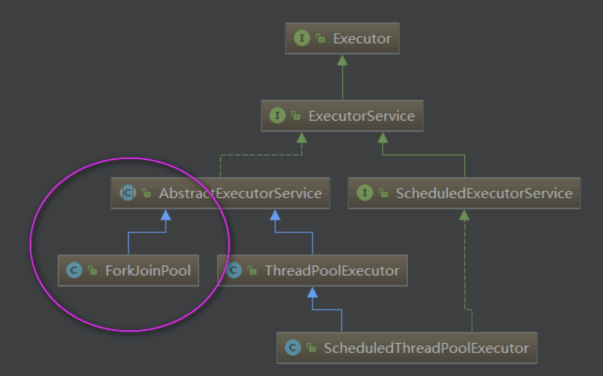
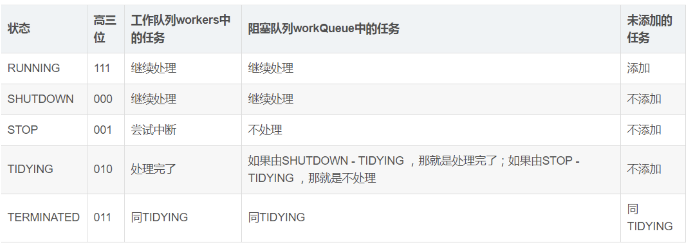
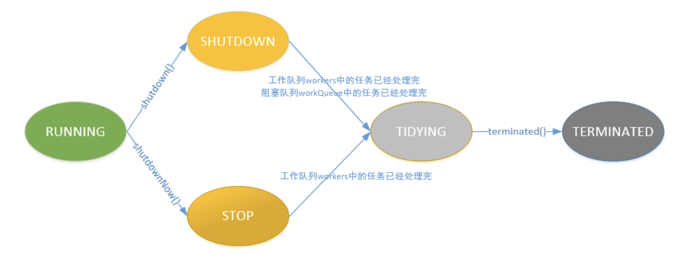

# 线程池

线程池可以看做是线程的集合。在没有任务时线程处于空闲状态，当请求到来：线程池给这个请求分配一个空闲的线程，任务完成后回到线程池中等待下次任务(而不是销毁)。这样就实现了线程的重用。

> 优点

- 线程重复利用，减少创建线程的个数，提高性能
- 提供限定和管理资源的手段

## JDK 提供的线程池 API

JDK 给我们提供了 Excutor 框架来使用线程池，它是线程池的基础。  
Executor 提供了一种将“任务提交”与“任务执行”分离开来的机制(解耦)

> JDK 线程池的总体 api 架构：

## ThreadPoolExecutor 详解

> 内部状态

变量 ctl 定义为 AtomicInteger，记录了“线程池中的任务数量”和“线程池的状态”两个信息。

> 线程的状态：

- RUNNING：线程池能够接受新任务，以及对新添加的任务进行处理。
- SHUTDOWN：线程池不可以接受新任务，但是可以对已添加的任务进行处理。
- STOP：线程池不接收新任务，不处理已添加的任务，并且会中断正在处理的任务。
- TIDYING：当所有的任务已终止，ctl 记录的"任务数量"为 0，线程池会变为 TIDYING 状态。当线程池变为 TIDYING 状态时，会执行钩子函数 terminated()。terminated()在 ThreadPoolExecutor 类中是空的，若用户想在线程池变为 TIDYING 时，进行相应的处理；可以通过重载 terminated()函数来实现。
- TERMINATED：线程池彻底终止的状态。各个状态之间转换：

> 各个状态之间转换：

> 常⻅的实现池

- newFixedThreadPool(固定线程数的线程池)
- newCachedThreadPool(如果此时线程池里没有空闲线程，线程池会毫不犹豫的创建一条新的线程去处理这个任务)
- SingleThreadExecutor(单线程)
