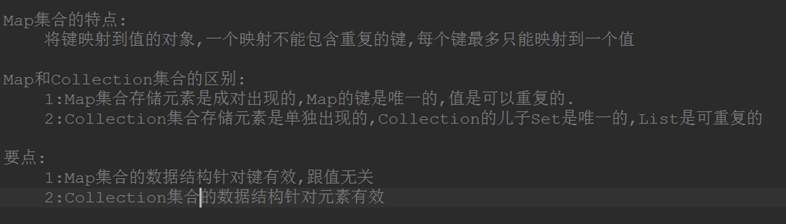

# Map

> 为什么需要 Map

Collection 叫做集合，它可以快速查找现有的元素。  
而 Map 在《Core Java》中称之为-->映射

举个例子:  
只要你掏出身份证(key)，那就可以证明是你自己(value)

> Map 与 Collection 的区别

## 简单常用的 Map 功能

### 有哪些 Map

## HashMap

Hash 的底层是散列表，而在 Java 中散列表的实现是通过数组+链表+红黑树的

> 特点：

- 无序，允许为 null，非同步
- 底层由散列表(哈希表)实现
- 初始容量和装载因子对 HashMap 影响挺大的，设置小了不好，设置大了也不好,当装载因子\*初始容量小于散列表元素时，该散列表会再散列，扩容 2 倍！装载因子的默认值是 0.75，无论是初始大了还是初始小了对我们 HashMap 的性能都不好
  - 装载因子初始值大了，可以减少散列表再散列(扩容的次数)，但同时会导致散列冲突的可能性变大(散列冲突也是耗性能的一个操作，要得操作链表(红黑树)！
  - 装载因子初始值小了，可以减小散列冲突的可能性，但同时扩容的次数可能就会变多！
- 初始容量的默认值是 16(服务从 Key 映射到 index 到 Hash 算法，符合 Hash 算法均匀分布的原则)
  - 初始容量过大，那么遍历时我们的速度就会受影响~
  - 初始容量过小，散列表再散列(扩容的次数)可能就变得多，扩容也是一件非常耗费性能的一件事

从源码上我们可以发现：HashMap 并不是直接拿 key 的哈希值来用的，它会将 key 的哈希值的高 16 位进行异或操作，使得我们将元素放入哈希表的时候增加了一定的随机性。

还要值得注意的是：并不是桶子上有 8 位元素的时候它就能变成红黑树，它得同时满足我们的散列表容量大于 64 才行

> ReHash

HashMap 的容量是有限的。当经过多次元素插入，使得 HashMap 达到一定饱和度时，Key 映射位置发生冲突的几率会逐渐提高。这时候，HashMap 需要扩展它的长度，也就是进行 Resize。

Hash 公式：

index = HashCode（Key） & （Length - 1）

当原数组长度为 8 时，Hash 运算是和 111B 做与运算；新数组长度为 16，Hash 运算是和 1111B 做与运算。Hash 结果显然不同。

HashMap 线程不安全的原因：多个线程同时 Resize，可能会形成链表环。需要线程安全，使用 ConCurrentHashMap。

### HashMap 与 Hashtable 对比

从存储结构和实现来讲基本上都是相同的。它和 HashMap 的最大的不同是它是线程安全的，另外它不允许 key 和 value 为 null。Hashtable 是个过时的集合类，不建议在新代码中使用，不需要线程安全的场合可以用 HashMap 替换，需要线程安全的场合可以用 ConcurrentHashMap 替换

## LinkedHashMap

LinkedHashMap 拥有 HashMap 的所有特性，它比 HashMap 多维护了一个双向链表，因此可以按照插入的顺序从头部或者从尾部迭代，是有序的，不过因为比 HashMap 多维护了一个双向链表，它的内存相比而言要比 HashMap 大，并且性能会差一些，但是如果需要考虑到元素插入的顺序的话，LinkedHashMap 不失为一种好的选择。

LinkedHashMap 可以设置两种遍历顺序：

- 访问顺序（access-ordered）
- 插入顺序（insertion-ordered）
- 默认是插入顺序的

LinkedHashMap 遍历的是内部维护的双向链表，所以说初始容量对 LinkedHashMap 遍历是不受影响的

## TreeMap

- 由于底层是红黑树，那么时间复杂度可以保证为 log(n)
- key 不能为 null，为 null 为抛出 NullPointException 的
- 想要自定义比较，在构造方法中传入 Comparator 对象，否则使用 key 的自然排序来进行比较
- TreeMap 非同步的，想要同步可以使用 Collections 来进行封装
