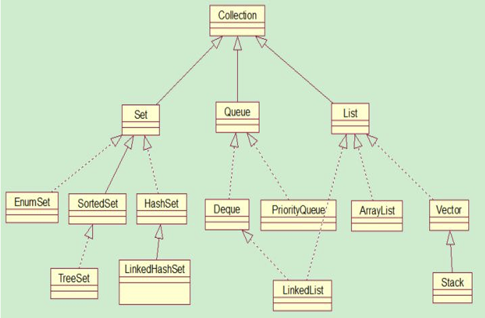
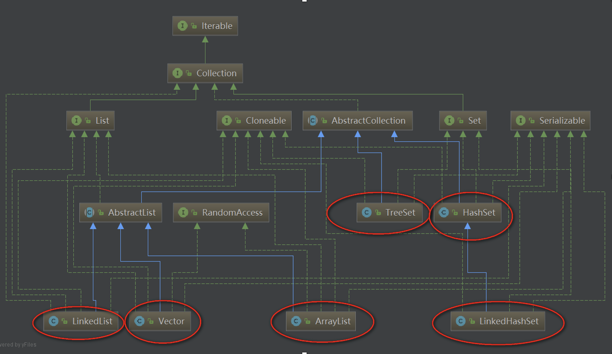
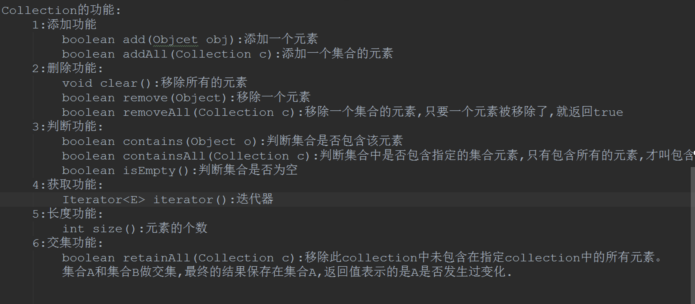

# 集合（Collection）

## 数组和集合的区别

- 长度的区别
  - 数组的长度固定
  - 集合的长度可变
- 内容不容
  - 数组存储的是同一种类型的元素
  - 集合可以存储不同类型的元素(但是一般我们不这样干..)
- 元素的数据类型
  - 数组可以存储基本数据类型,也可以存储引用类型
  - 集合只能存储引用类型(你存储的是简单的 int，它会自动装箱成 Integer)

## 所有集合

## 重要的集合

## 主要功能

## 迭代器(Iterator)介绍

我们可以发现 Collection 的源码中继承了 Iterable，有 iterator()这个方法，Iterator 也是一个接口，它只有三个方法：

- hasNext()
- next()
- remove()

从源码可知：Iterator 实际上就是在遍历集合

所以说：我们遍历集合(Collection)的元素都可以使用 Iterator，至于它的具体实现是以内部类的方式实现的！
