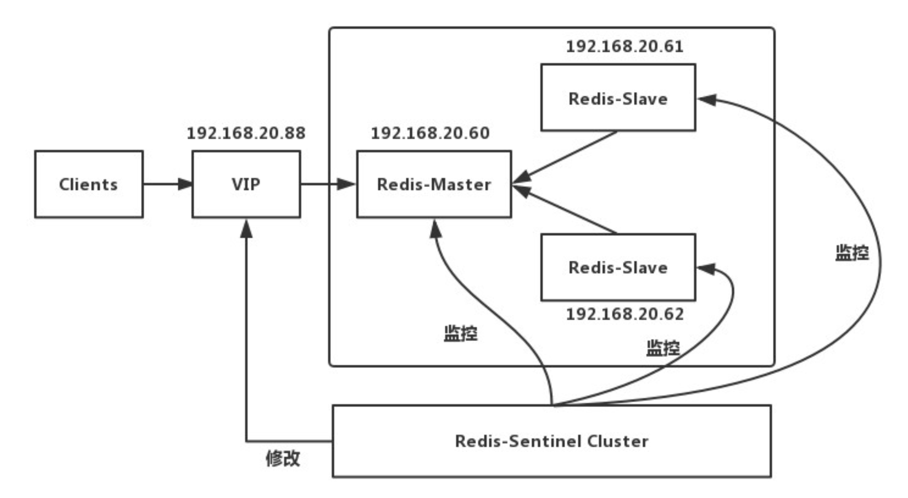
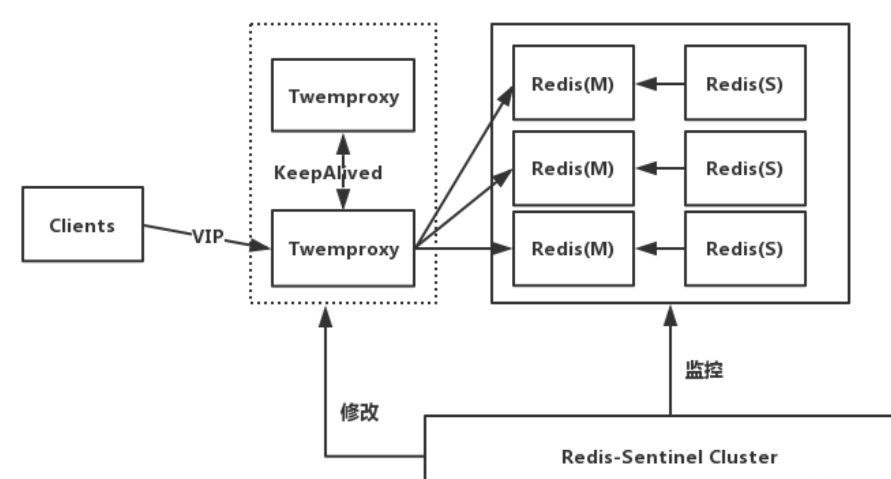
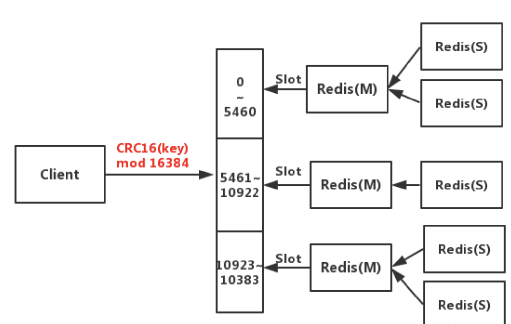

# Redis 集群架构

## Replication+Sentinel

这套架构使用的是社区版本推出的原生高可用解决方案，其架构图如下

这里 Sentinel 的作用有三个:

- 监控:Sentinel 会不断的检查主服务器和从服务器是否正常运行。
- 通知:当被监控的某个 redis 服务器出现问题，Sentinel 通过 API 脚本向管理员或者其他的应用程序发送通知。
- 自动故障转移:当主节点不能正常工作时，Sentinel 会开始一次自动的故障转移操作，它会将与失效主节点是主从关系 的其中一个从节点升级为新的主节点，并且将其他的从节点指向新的主节点。

工作原理就是，当 Master 宕机的时候，Sentinel 会选举出新的 Master，并根据 Sentinel 中 client-reconfig-script 脚本配置的内容，去动态修改 VIP(虚拟 IP)，将 VIP(虚拟 IP)指向新的 Master。我们的客户端就连向指定的 VIP 即可！
故障发生后的转移情况，

缺陷:

- 主从切换的过程中会丢数据
- Redis 只能单点写，不能水平扩容

## Proxy+Replication+Sentinel

这里的 Proxy 目前有两种选择:Codis 和 Twemproxy。

这里以 Twemproxy 为例说明，如下图所示

工作原理如下

- 前端使用 Twemproxy+KeepAlived 做代理，将其后端的多台 Redis 实例分片进行统一管理与分配
- 每一个分片节点的 Slave 都是 Master 的副本且只读
- Sentinel 持续不断的监控每个分片节点的 Master，当 Master 出现故障且不可用状态时，Sentinel 会通知/启动自动故障转移等动作
- Sentinel 可以在发生故障转移动作后触发相应脚本（通过 client-reconfig-script 参数配置 ），脚本获取到最新的 Master 来修改 Twemproxy 配置

缺陷:

- 部署结构超级复杂
- 可扩展性差，进行扩缩容需要手动干预
- 运维不方便

## Redis Cluster

有完善的运维工具？可以参照一下搜狐出的 CacheCloud。
公司在生产用过？我接触到的时候，百度贴吧，美团等大厂都用过了。
比如没有 Release 版？我接触到的时候距离 Redis Cluster 发布 Release 版已经很久。
而且毕竟是官网出的，肯定会一直维护、更新下去，未来必定会更加成熟、稳定。换句话说，Redis 不倒，Redis Cluster 就不会放弃维护。所以，推荐还是这套架构!

工作原理如下

- 客户端与 Redis 节点直连,不需要中间 Proxy 层，直接连接任意一个 Master 节点
- 根据公式 HASH_SLOT=CRC16(key) mod 16384，计算出映射到哪个分片上，然后 Redis 会去相应的节点进行操作

具有如下优点:

- 无需 Sentinel 哨兵监控，如果 Master 挂了，Redis Cluster 内部自动将 Slave 切换 Master
- 可以进行水平扩容
- 支持自动化迁移，当出现某个 Slave 宕机了，那么就只有 Master 了，这时候的高可用性就无法很好的保证了，万一 master 也宕机了，咋办呢？ 针对这种情况，如果说其他 Master 有多余的 Slave ，集群自动把多余的 Slave 迁移到没有 Slave 的 Master 中。

缺点:

- 批量操作是个坑
- 资源隔离性较差，容易出现相互影响的情况。

问题 1:懂 Redis 事务么？
正常版：Redis 事务是一些列 redis 命令的集合,blabla...
高调版: 我们在生产上采用的是 Redis Cluster 集群架构，不同的 key 是有可能分配在不同的 Redis 节点上的，在这种情况下 Redis 的事务机制是不生效的。其次，Redis 事务不支持回滚操作，简直是鸡肋！所以基本不用！

问题 2:Redis 的多数据库机制，了解多少？
正常版：Redis 支持多个数据库，并且每个数据库的数据是隔离的不能共享，单机下的 redis 可以支持 16 个数据库（db0 ~ db15）
高调版: 在 Redis Cluster 集群架构下只有一个数据库空间，即 db0。因此，我们没有使用 Redis 的多数据库功能！

问题 3:Redis 集群机制中，你觉得有什么不足的地方吗？
正常版: 不知道
高调版: 假设我有一个 key，对应的 value 是 Hash 类型的。如果 Hash 对象非常大，是不支持映射到不同节点的！只能映射到集群中的一个节点上！还有就是做批量操作比较麻烦！

问题 4:懂 Redis 的批量操作么？
正常版: 懂一点。比如 mset、mget 操作等，blabla
高调版: 我们在生产上采用的是 Redis Cluster 集群架构，不同的 key 会划分到不同的 slot 中，因此直接使用 mset 或者 mget 等操作是行不通的。

问题 5:那在 Redis 集群模式下，如何进行批量操作？
正常版:不知道
高调版:这个问题其实可以写一篇文章了，改天写。这里说一种有一个很简单的答法，足够面试用。即:
如果执行的 key 数量比较少，就不用 mget 了，就用串行 get 操作。如果真的需要执行的 key 很多，就使用 Hashtag 保证这些 key 映射到同一台 redis 节点上。简单来说语法如下

ps:如果你用的是 Proxy 分片集群架构，例如 Codis 这种，会将 mget/mset 的多个 key 拆分成多个命令发往不同得 redis 实例，这里不多说。我推荐答的还是 redis cluster。

问题 6:你们有对 Redis 做读写分离么？
正常版:没有做，至于原因额。。。额。。。额。。没办法了，硬着头皮扯~
高调版:不做读写分离。我们用的是 Redis Cluster 的架构，是属于分片集群的架构。而 redis 本身在内存上操作，不会涉及 IO 吞吐，即使读写分离也不会提升太多性能，Redis 在生产上的主要问题是考虑容量，单机最多 10-20G，key 太多降低 redis 性能.因此采用分片集群结构，已经能保证了我们的性能。其次，用上了读写分离后，还要考虑主从一致性，主从延迟等问题，徒增业务复杂度。
