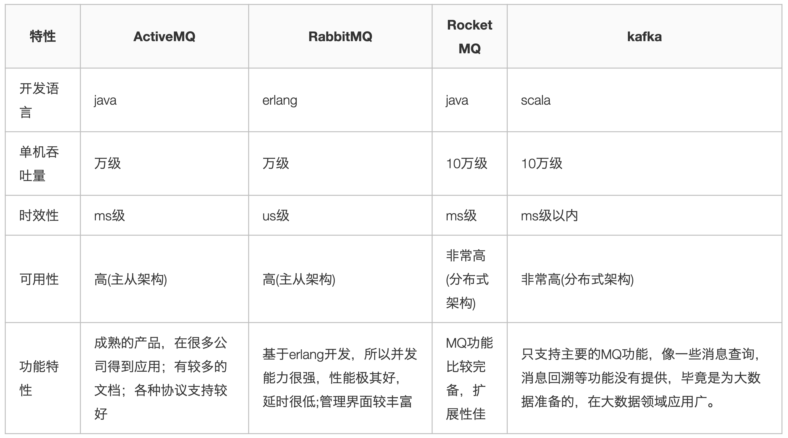
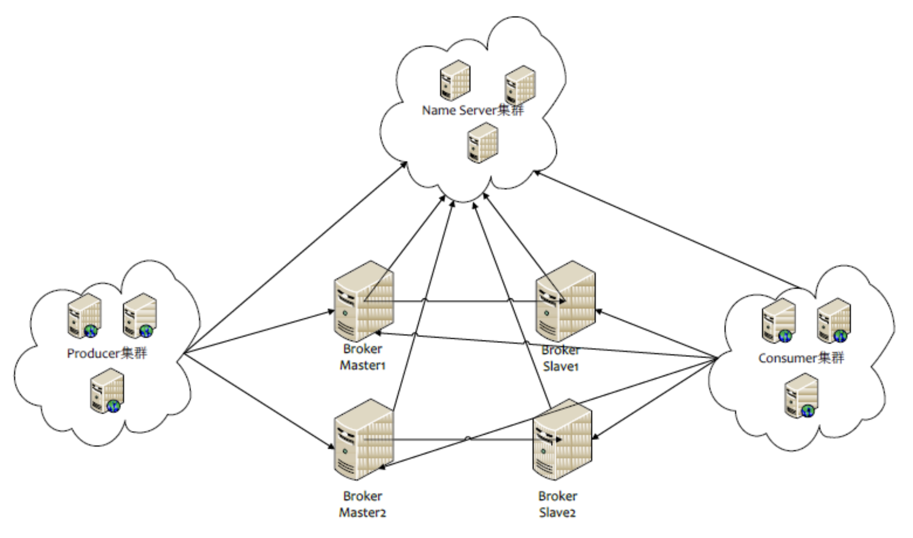

# 分布式之消息队列复习精讲

- 为什么使用消息队列？
- 使用消息队列有什么缺点?
- 消息队列如何选型?
- 如何保证消息队列是高可用的？
- 如何保证消息不被重复消费?
- 如何保证消费的可靠性传输?
- 如何保证消息的顺序性？

> 为什么要使用消息队列?

- 解耦

  - 传统模式的缺点：系统间耦合性太强，系统 A 在代码中直接调用系统 B 和系统 C 的代码，如果将来 D 系统接入，系统 A 还需要修改代码，过于麻烦！
  - 中间件模式的的优点：将消息写入消息队列，需要消息的系统自己从消息队列中订阅，从而系统 A 不需要做任何修改。

- 异步

  - 传统模式的缺点：一些非必要的业务逻辑以同步的方式运行，太耗费时间。
  - 中间件模式的的优点：将消息写入消息队列，非必要的业务逻辑以异步的方式运行，加快响应速度

- 削峰
  - 传统模式的缺点：并发量大的时候，所有的请求直接怼到数据库，造成数据库连接异常
  - 中间件模式的的优点：系统 A 慢慢的按照数据库能处理的并发量，从消息队列中慢慢拉取消息。在生产中，这个短暂的高峰期积压是允许的。

> 使用了消息队列会有什么缺点?

- 系统可用性降低:本来其他系统只要运行好好的，那你的系统就是正常的。现在你非要加个消息队列进去，那消息队列挂了，你的系统不是呵呵了。因此，系统可用性降低
- 系统复杂性增加:要多考虑很多方面的问题，比如一致性问题、如何保证消息不被重复消费，如何保证保证消息可靠传输。因此，需要考虑的东西更多，系统复杂性增大。

> 消息队列如何选型?

综合上面的材料得出以下两点:

- (1)中小型软件公司，建议选 RabbitMQ.一方面，erlang 语言天生具备高并发的特性，而且他的管理界面用起来十分方便。正所谓，成也萧何，败也萧何！他的弊端也在这里，虽然 RabbitMQ 是开源的，然而国内有几个能定制化开发 erlang 的程序员呢？所幸，RabbitMQ 的社区十分活跃，可以解决开发过程中遇到的 bug，这点对于中小型公司来说十分重要。不考虑 rocketmq 和 kafka 的原因是，一方面中小型软件公司不如互联网公司，数据量没那么大，选消息中间件，应首选功能比较完备的，所以 kafka 排除。不考虑 rocketmq 的原因是，rocketmq 是阿里出品，如果阿里放弃维护 rocketmq，中小型公司一般抽不出人来进行 rocketmq 的定制化开发，因此不推荐。
- (2)大型软件公司，根据具体使用在 rocketMq 和 kafka 之间二选一。一方面，大型软件公司，具备足够的资金搭建分布式环境，也具备足够大的数据量。针对 rocketMQ,大型软件公司也可以抽出人手对 rocketMQ 进行定制化开发，毕竟国内有能力改 JAVA 源码的人，还是相当多的。至于 kafka，根据业务场景选择，如果有日志采集功能，肯定是首选 kafka 了。具体该选哪个，看使用场景。

> 如何保证消息队列是高可用的？

这问题，其实要对消息队列的集群模式要有深刻了解，才好回答。

以 rcoketMQ 为例，他的集群就有多 master 模式、多 master 多 slave 异步复制模式、多 master 多 slave 同步双写模式。多 master 多 slave 模式部署架构图:

Producer 与 NameServer 集群中的其中一个节点（随机选择）建立长连接，定期从 NameServer 获取 Topic 路由信息，并向提供 Topic 服务的 Broker Master 建立长连接，且定时向 Broker 发送心跳。Producer 只能将消息发送到 Broker master，但是 Consumer 则不一样，它同时和提供 Topic 服务的 Master 和 Slave 建立长连接，既可以从 Broker Master 订阅消息，也可以从 Broker Slave 订阅消息。

> 如何保证消息不被重复消费？

先来说一下为什么会造成重复消费?

因为网络传输等等故障，确认信息没有传送到消息队列，导致消息队列不知道自己已经消费过该消息了，再次将该消息分发给其他的消费者。

如何解决?这个问题针对业务场景来答分以下几点

- (1)比如，你拿到这个消息做数据库的 insert 操作。那就容易了，给这个消息做一个唯一主键，那么就算出现重复消费的情况，就会导致主键冲突，避免数据库出现脏数据。
- (2)再比如，你拿到这个消息做 redis 的 set 的操作，那就容易了，不用解决，因为你无论 set 几次结果都是一样的，set 操作本来就算幂等操作。
- (3)如果上面两种情况还不行，上大招。准备一个第三方介质,来做消费记录。以 redis 为例，给消息分配一个全局 id，只要消费过该消息，将<id,message>以 K-V 形式写入 redis。那消费者开始消费前，先去 redis 中查询有没消费记录即可。

> 如何保证消费的可靠性传输?

每种 MQ 都要从三个角度来分析:生产者弄丢数据、消息队列弄丢数据、消费者弄丢数据

RabbitMQ

- (1)生产者丢数据  
  从生产者弄丢数据这个角度来看，RabbitMQ 提供 transaction 和 confirm 模式来确保生产者不丢消息。  
  transaction 机制就是说，发送消息前，开启事物(channel.txSelect())，然后发送消息，如果发送过程中出现什么异常，事物就会回滚(channel.txRollback())，如果发送成功则提交事物(channel.txCommit())。  
  然而缺点就是吞吐量下降了。因此，生产上用 confirm 模式的居多。一旦 channel 进入 confirm 模式，所有在该信道上面发布的消息都将会被指派一个唯一的 ID(从 1 开始)，一旦消息被投递到所有匹配的队列之后，rabbitMQ 就会发送一个 Ack 给生产者(包含消息的唯一 ID)，这就使得生产者知道消息已经正确到达目的队列了.如果 rabiitMQ 没能处理该消息，则会发送一个 Nack 消息给你，你可以进行重试操作.

- (2)消息队列丢数据  
  处理消息队列丢数据的情况，一般是开启持久化磁盘的配置。这个持久化配置可以和 confirm 机制配合使用，你可以在消息持久化磁盘后，再给生产者发送一个 Ack 信号。这样，如果消息持久化磁盘之前，rabbitMQ 阵亡了，那么生产者收不到 Ack 信号，生产者会自动重发。
  那么如何持久化呢，这里顺便说一下吧，其实也很容易，就下面两步

  - 1、将 queue 的持久化标识 durable 设置为 true,则代表是一个持久的队列
  - 2、发送消息的时候将 deliveryMode=2

  这样设置以后，rabbitMQ 就算挂了，重启后也能恢复数据

- (3)消费者丢数据  
  消费者丢数据一般是因为采用了自动确认消息模式。这种模式下，消费者会自动确认收到信息。这时 rahbitMQ 会立即将消息删除，这种情况下如果消费者出现异常而没能处理该消息，就会丢失该消息。  
  至于解决方案，采用手动确认消息即可。

> 如何保证消息的顺序性？

针对这个问题，通过某种算法，将需要保持先后顺序的消息放到同一个消息队列中(kafka 中就是 partition,rabbitMq 中就是 queue)。然后只用一个消费者去消费该队列。

有的人会问:那如果为了吞吐量，有多个消费者去消费怎么办？

这个问题，没有固定回答的套路。比如我们有一个微博的操作，发微博、写评论、删除微博，这三个异步操作。如果是这样一个业务场景，那只要重试就行。比如你一个消费者先执行了写评论的操作，但是这时候，微博都还没发，写评论一定是失败的，等一段时间。等另一个消费者，先执行写评论的操作后，再执行，就可以成功。

总之，针对这个问题，我的观点是保证入队有序就行，出队以后的顺序交给消费者自己去保证，没有固定套路。
