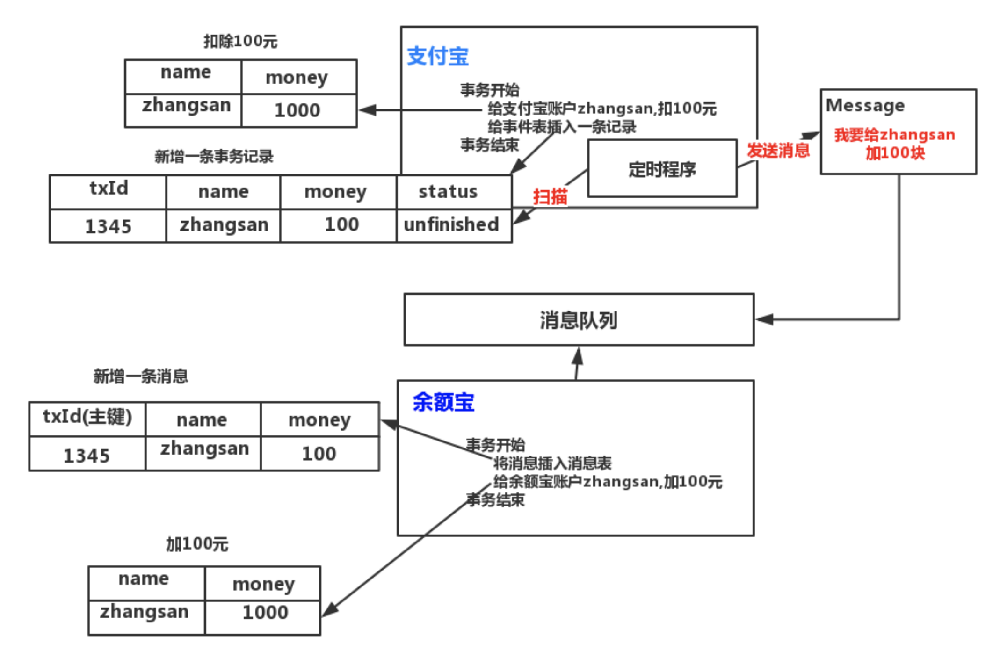

# 消息队列处理分布式事务

企业现在的架构都由传统的架构转向了微服务架构，如下图所示:

那么，都不可避免的会遇到跨数据库调用的，分布式事务问题！  
目前，业内解决分布式事务问题，都基本不用 JTA 这种强一致性的解决方案，基本是采用如下两套方案

- 基于 TCC 的事务框架
- 消息队列

(1)图中的服务 A 和服务 B，如果是同步调用，要求一起成功，或者一起失败，那么此时应选用 TCC 的事务框架
(2)图中的服务 A 和服务 B，如果是异步调用，比如服务 C 先调用服务 A 后，服务 C 不用管服务 B 的执行结果，直接返回，那么这种情况下，应选用消息队列！

## 案例

先给大家套一个业务场景，也是很常见的一个异步调用场景:

- 支付宝往余额宝转钱

即将服务 A 假设为支付宝，服务 B 假设为余额宝。  
于是呢，我们的支付宝往余额宝转 100 块钱是怎么做的呢？  
特别容易，借助消息队列即可，如下图所示

> 一致性解决

OK，上面这一版有一个致命的问题！如下所示

事务开始

    - (1)给支付宝账户 zhangsan,扣 100 元
    - (2)将(给余额宝账户 zhangsan,加 100 元)封装为消息，发送给消息队列

事务结束

如何保证第一步和第二步是在同一个事务里完成的。换句话说，第一步操作的是数据库，第二步操作的是一个消息队列，你如何保证这两步之间的一致性？  
任何涉及到数据库和中间件之间的业务逻辑操作，都需要考虑二者之间的一致性。比如，你先操作了数据库，再操作缓存，数据库和缓存之间一致性如何解决？

改变思路，加一张事务表，如下图所示

> 幂等性解决

还存在一个幂等性问题!  
仔细看，定时程序做了如下三个操作

- (1)定时扫描事务表，发现一个状态为'UNFINISHED'的事件
- (2)将事件信息，封装为消息，发送到消息中间件
- (3)将事件状态改为'FINISHED'

OK，假设在步骤(2)的时候，发送完消息体，还未执行步骤(3),定时程序阵亡了！然后重启定时程序，发现刚那个事务的状态依然为'UNFINISHED'，因此重新发送。这样，就会出现重复消费问题。因此，幂等性也是需要保证的！

在消费者端，也维护一个带主键的表，可以选 txid 为主键，如下图所示

如果一旦出现重复消费，则在事务里直接报出主键冲突错误，从而保证了幂等性
