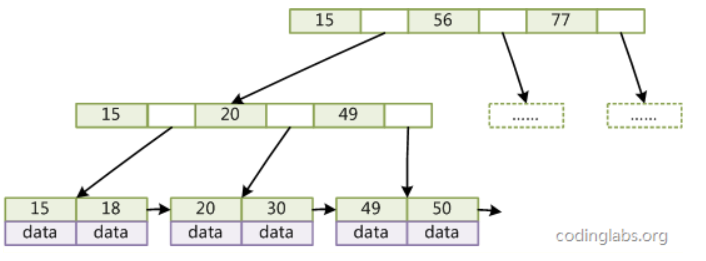
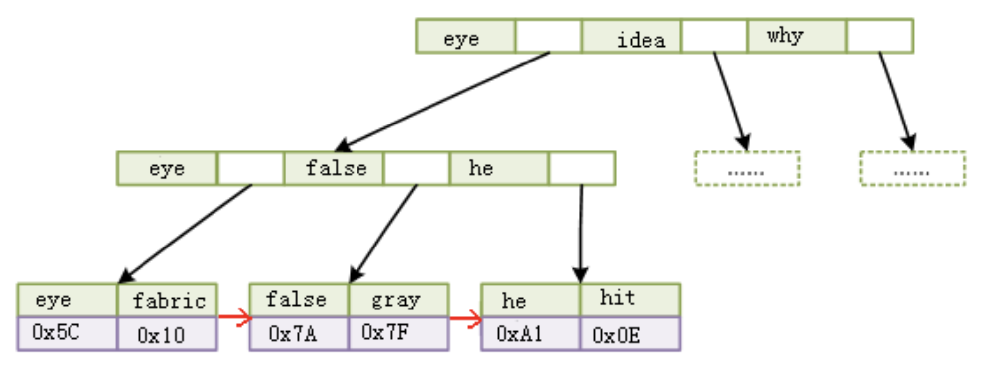
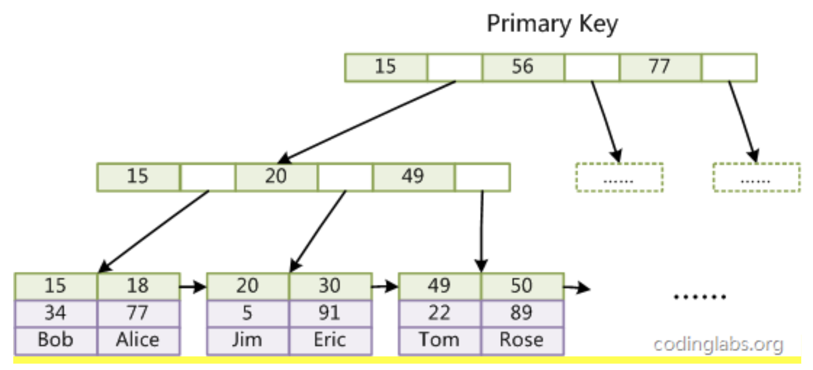
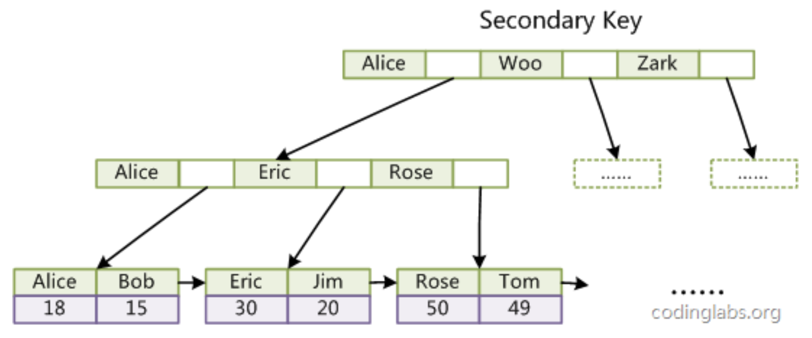

# 索引的本质

MySQL 官方对索引的定义为：索引（Index）是帮助 MySQL 高效获取数据的数据结构。提取句子主干，就可以得到索引的本质：索引是数据结构。

我们知道，数据库查询是数据库的最主要功能之一。我们都希望查询数据的速度能尽可能的快，因此数据库系统的设计者会从查询算法的角度进行优化。最基本的查询算法当然是顺序查找（linear search），这种复杂度为 O(n)的算法在数据量很大时显然是糟糕的，好在计算机科学的发展提供了很多更优秀的查找算法，例如二分查找（binary search）、二叉树查找（binary tree search）等。

如果稍微分析一下会发现，每种查找算法都只能应用于特定的数据结构之上，例如二分查找要求被检索数据有序，而二叉树查找只能应用于二叉查找树上，但是数据本身的组织结构不可能完全满足各种数据结构（例如，理论上不可能同时将两列都按顺序进行组织），所以，在数据之外，数据库系统还维护着满足特定查找算法的数据结构，这些数据结构以某种方式引用（指向）数据，这样就可以在这些数据结构上实现高级查找算法。这种数据结构，就是索引。

## B-Tree（平衡多路查找树）

B-Tree 是为磁盘等外存储设备设计的一种平衡查找树。因此在讲 B-Tree 之前先了解下磁盘的相关知识。

系统从磁盘读取数据到内存时是以磁盘块（block）为基本单位的，位于同一个磁盘块中的数据会被一次性读取出来，而不是需要什么取什么。

InnoDB 存储引擎中有页（Page）的概念，页是其磁盘管理的最小单位。InnoDB 存储引擎中默认每个页的大小为 16KB，可通过参数 innodb_page_size 将页的大小设置为 4K、8K、16K，

而系统一个磁盘块的存储空间往往没有这么大，因此 InnoDB 每次申请磁盘空间时都会是若干地址连续磁盘块来达到页的大小 16KB。InnoDB 在把磁盘数据读入到磁盘时会以页为基本单位，在查询数据时如果一个页中的每条数据都能有助于定位数据记录的位置，这将会减少磁盘 I/O 次数，提高查询效率。

B-Tree 结构的数据可以让系统高效的找到数据所在的磁盘块。为了描述 B-Tree，首先定义一条记录为一个二元组[key, data] ，key 为记录的键值，对应表中的主键值，data 为一行记录中除主键外的数据。对于不同的记录，key 值互不相同。

每个节点占用一个盘块的磁盘空间，一个节点上有两个升序排序的关键字和三个指向子树根节点的指针，指针存储的是子节点所在磁盘块的地址。两个关键词划分成的三个范围域对应三个指针指向的子树的数据的范围域。以根节点为例，关键字为 17 和 35，P1 指针指向的子树的数据范围为小于 17，P2 指针指向的子树的数据范围为 17~35，P3 指针指向的子树的数据范围为大于 35。

模拟查找关键字 29 的过程：

- 根据根节点找到磁盘块 1，读入内存。【磁盘 I/O 操作第 1 次】
- 比较关键字 29 在区间（17,35），找到磁盘块 1 的指针 P2。
- 根据 P2 指针找到磁盘块 3，读入内存。【磁盘 I/O 操作第 2 次】
- 比较关键字 29 在区间（26,30），找到磁盘块 3 的指针 P2。
- 根据 P2 指针找到磁盘块 8，读入内存。【磁盘 I/O 操作第 3 次】
- 在磁盘块 8 中的关键字列表中找到关键字 29。

分析上面过程，发现需要 3 次磁盘 I/O 操作，和 3 次内存查找操作。由于内存中的关键字是一个有序表结构，可以利用二分法查找提高效率。而 3 次磁盘 I/O 操作是影响整个 B-Tree 查找效率的决定因素。B-Tree 相对于 AVLTree 缩减了节点个数，使每次磁盘 I/O 取到内存的数据都发挥了作用，从而提高了查询效率。

## B+Tree

B+Tree 是在 B-Tree 基础上的一种优化，使其更适合实现外存储索引结构，InnoDB 存储引擎就是用 B+Tree 实现其索引结构。

从上一节中的 B-Tree 结构图中可以看到每个节点中不仅包含数据的 key 值，还有 data 值。而每一个页的存储空间是有限的，如果 data 数据较大时将会导致每个节点（即一个页）能存储的 key 的数量很小，当存储的数据量很大时同样会导致 B-Tree 的深度较大，增大查询时的磁盘 I/O 次数，进而影响查询效率。在 B+Tree 中，所有数据记录节点都是按照键值大小顺序存放在同一层的叶子节点上，而非叶子节点上只存储 key 值信息，这样可以大大加大每个节点存储的 key 值数量，降低 B+Tree 的高度。

B+Tree 相对于 B-Tree 有几点不同：

- 非叶子节点只存储键值信息。
- 所有叶子节点之间都有一个链指针。
- 数据记录都存放在叶子节点中。

将上一节中的 B-Tree 优化，由于 B+Tree 的非叶子节点只存储键值信息，假设每个磁盘块能存储 4 个键值及指针信息，则变成 B+Tree 后其结构如下图所示：

通常在 B+Tree 上有两个头指针，一个指向根节点，另一个指向关键字最小的叶子节点，而且所有叶子节点（即数据节点）之间是一种链式环结构。因此可以对 B+Tree 进行两种查找运算：一种是对于主键的范围查找和分页查找，另一种是从根节点开始，进行随机查找。

## 为什么使用 B-Tree（B+Tree）

上文说过，红黑树等数据结构也可以用来实现索引，但是文件系统及数据库系统普遍采用 B-/+Tree 作为索引结构，这一节将结合计算机组成原理相关知识讨论 B-/+Tree 作为索引的理论基础。

一般来说，索引本身也很大，不可能全部存储在内存中，因此索引往往以索引文件的形式存储的磁盘上。这样的话，索引查找过程中就要产生磁盘 I/O 消耗，相对于内存存取，I/O 存取的消耗要高几个数量级，所以评价一个数据结构作为索引的优劣最重要的指标就是在查找过程中磁盘 I/O 操作次数的渐进复杂度。换句话说，索引的结构组织要尽量减少查找过程中磁盘 I/O 的存取次数。

### B-/+Tree 索引的性能分析

上文说过一般使用磁盘 I/O 次数评价索引结构的优劣。先从 B-Tree 分析，根据 B-Tree 的定义，可知检索一次最多需要访问 h 个节点。数据库系统的设计者巧妙利用了磁盘预读原理，将一个节点的大小设为等于一个页，这样每个节点只需要一次 I/O 就可以完全载入。为了达到这个目的，在实际实现 B-Tree 还需要使用如下技巧：

每次新建节点时，直接申请一个页的空间，这样就保证一个节点物理上也存储在一个页里，加之计算机存储分配都是按页对齐的，就实现了一个 node 只需一次 I/O。

B-Tree 中一次检索最多需要 h-1 次 I/O（根节点常驻内存），渐进复杂度为 O(h)=O(logdN)O(h)=O(logdN)。一般实际应用中，出度 d 是非常大的数字，通常超过 100，因此 h 非常小（通常不超过 3）。

综上所述，用 B-Tree 作为索引结构效率是非常高的。

而红黑树这种结构，h 明显要深的多。由于逻辑上很近的节点（父子）物理上可能很远，无法利用局部性，所以红黑树的 I/O 渐进复杂度也为 O(h)，效率明显比 B-Tree 差很多。

上文还说过，B+Tree 更适合外存索引，原因和内节点出度 d 有关。从上面分析可以看到，d 越大索引的性能越好，而出度的上限取决于节点内 key 和 data 的大小：

dmax=floor(pagesize/(keysize+datasize+pointsize))dmax=floor(pagesize/(keysize+datasize+pointsize))

floor 表示向下取整。由于 B+Tree 内节点去掉了 data 域，因此可以拥有更大的出度，拥有更好的性能。

## 聚簇索引与非聚簇索引

mysql 中普遍使用 B+Tree 做索引，但在实现上又根据聚簇索引和非聚簇索引而不同。

> 聚簇索引

所谓聚簇索引，就是指主索引文件和数据文件为同一份文件，聚簇索引主要用在 Innodb 存储引擎中。在该索引实现方式中 B+Tree 的叶子节点上的 data 就是数据本身，key 为主键，如果是一般索引的话，data 便会指向对应的主索引，如下图所示：

在 B+Tree 的每个叶子节点增加一个指向相邻叶子节点的指针，就形成了带有顺序访问指针的 B+Tree。做这个优化的目的是为了提高区间访问的性能，例如上图中如果要查询 key 为从 18 到 49 的所有数据记录，当找到 18 后，只需顺着节点和指针顺序遍历就可以一次性访问到所有数据节点，极大提到了区间查询效率。

> 非聚簇索引

非聚簇索引就是指 B+Tree 的叶子节点上的 data，并不是数据本身，而是数据存放的地址。主索引和辅助索引没啥区别，只是主索引中的 key 一定得是唯一的。主要用在 MyISAM 存储引擎中，如下图：

非聚簇索引比聚簇索引多了一次读取数据的 IO 操作，所以查找性能上会差。

## MySQL InnoDB 索引实现

> InnoDB 的数据文件本身就是索引文件。在 InnoDB 中，表数据文件本身就是按 B+Tree 组织的一个索引结构，这棵树的叶节点 data 域保存了完整的数据记录。这个索引的 key 是数据表的主键，因此 InnoDB 表数据文件本身就是主索引。

上图是 InnoDB 主索引（同时也是数据文件）的示意图，可以看到叶节点包含了完整的数据记录。这种索引叫做聚集索引。因为 InnoDB 的数据文件本身要按主键聚集，所以 InnoDB 要求表必须有主键（MyISAM 可以没有），如果没有显式指定，则 MySQL 系统会自动选择一个可以唯一标识数据记录的列作为主键，如果不存在这种列，则 MySQL 自动为 InnoDB 表生成一个隐含字段作为主键，这个字段长度为 6 个字节，类型为长整形。

InnoDB 的辅助索引 data 域存储相应记录主键的值而不是地址。换句话说，InnoDB 的所有辅助索引都引用主键作为 data 域。例如，下图为定义在 Col3 上的一个辅助索引：

这里以英文字符的 ASCII 码作为比较准则。聚集索引这种实现方式使得按主键的搜索十分高效，但是辅助索引搜索需要检索两遍索引：首先检索辅助索引获得主键，然后用主键到主索引中检索获得记录。

了解不同存储引擎的索引实现方式对于正确使用和优化索引都非常有帮助，例如知道了 InnoDB 的索引实现后，就很容易明白为什么不建议使用过长的字段作为主键，因为所有辅助索引都引用主索引，过长的主索引会令辅助索引变得过大。再例如，用非单调的字段作为主键在 InnoDB 中不是个好主意，因为 InnoDB 数据文件本身是一颗 B+Tree，非单调的主键会造成在插入新记录时数据文件为了维持 B+Tree 的特性而频繁的分裂调整，十分低效，而使用自增字段作为主键则是一个很好的选择。

对于 InnoDB 而言，因为节点下有数据文件，因此节点的分裂将会比较慢。对于 InnoDB 的主键，尽量用整型，而且是递增的整型。如果是无规律的数据，将会产生页的分裂，影响速度。
