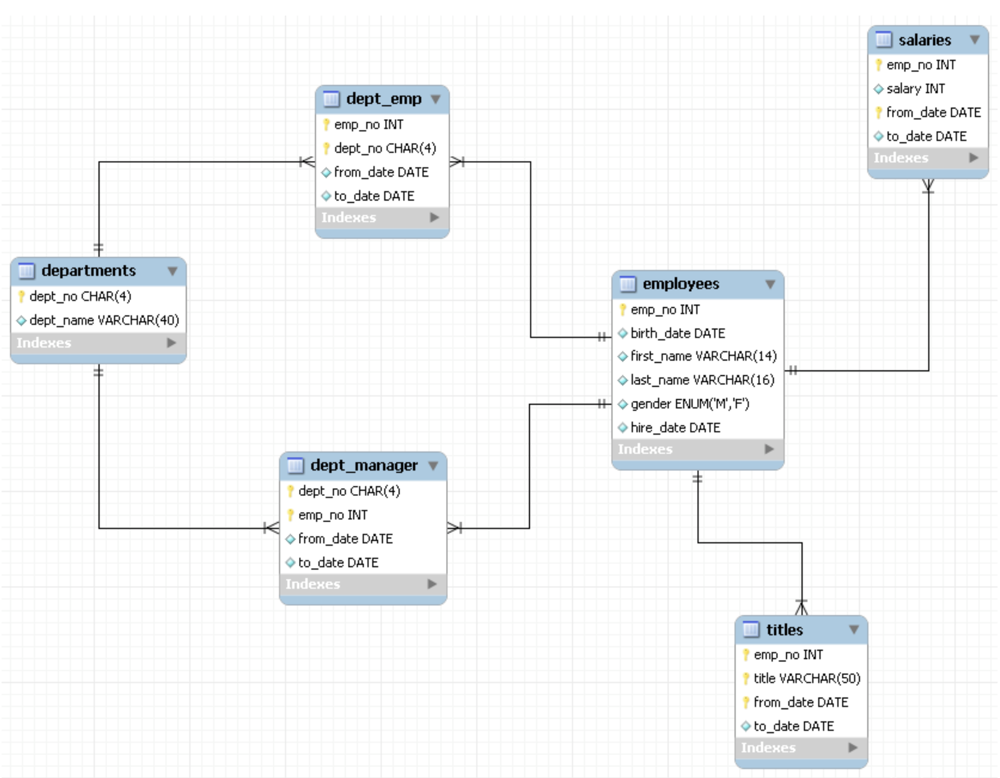

# 索引使用策略及优化

MySQL 的优化主要分为结构优化（Scheme optimization）和查询优化（Query optimization）。本章讨论的高性能索引策略主要属于结构优化范畴。

为了讨论索引策略，需要一个数据量不算小的数据库作为示例。本文选用 MySQL 官方文档中提供的示例数据库之一：employees。这个数据库关系复杂度适中，且数据量较大。下图是这个数据库的 E-R 关系图（引用自 MySQL 官方手册）：

## 最左前缀原理与相关优化

高效使用索引的首要条件是知道什么样的查询会使用到索引，这个问题和 B+Tree 中的“最左前缀原理”有关，下面通过例子说明最左前缀原理。

这里先说一下联合索引的概念。在上文中，我们都是假设索引只引用了单个的列，实际上，MySQL 中的索引可以以一定顺序引用多个列，这种索引叫做联合索引，一般的，一个联合索引是一个有序元组<a1, a2, …, an>，其中各个元素均为数据表的一列，单列索引可以看成联合索引元素数为 1 的特例。

假设主索引为<emp_no, title, from_date>

key_len：表示本次查询中，所选择的索引长度有多少字节，通常我们可借此判断联合索引有多少列被选择了。

- 全列匹配（和查询字段顺序无关）

  sql：SELECT \* FROM employees.titles WHERE emp_no='10001' AND title='Senior Engineer' AND from_date='1986-06-26';

  result：key_len=59

- 最左前缀匹配

  sql：SELECT \* FROM employees.titles WHERE emp_no='10001';

  result：key_len=4

- 查询条件用到了索引中列的精确匹配，但是中间某个条件未提供

  sql：SELECT \* FROM employees.titles WHERE emp_no='10001' AND from_date='1986-06-26';

  result：key_len=4

- 查询条件没有指定索引第一列

  sql：SELECT \* FROM employees.titles WHERE from_date='1986-06-26';

  result：key_len=null

- 匹配某列的前缀字符串

  sql：SELECT \* FROM employees.titles WHERE emp_no='10001' AND title LIKE 'Senior%';

  result：key_len=56

- 范围查询

  sql：SELECT \* FROM employees.titles WHERE emp_no < '10010' and title='Senior Engineer';

  result：key_len=4

- 查询条件中含有函数或表达式

  sql：SELECT \* FROM employees.titles WHERE emp_no='10001' AND left(title, 6)='Senior';

  result：key_len=4

  sql：SELECT \* FROM employees.titles WHERE emp_no - 1='10000';

  result：key_len=null

## 索引选择性与前缀索引

既然索引可以加快查询速度，那么是不是只要是查询语句需要，就建上索引？答案是否定的。因为索引虽然加快了查询速度，但索引也是有代价的：索引文件本身要消耗存储空间，同时索引会加重插入、删除和修改记录时的负担，另外，MySQL 在运行时也要消耗资源维护索引，因此索引并不是越多越好。一般两种情况下不建议建索引。

- 第一种情况是表记录比较少（例如一两千条甚至只有几百条记录的表，没必要建索引，让查询做全表扫描就好了。至于多少条记录才算多，这个个人有个人的看法，我个人的经验是以 2000 作为分界线，记录数不超过 2000 可以考虑不建索引，超过 2000 条可以酌情考虑索引。）

另一种不建议建索引的情况是索引的选择性较低。所谓索引的选择性（Selectivity），是指不重复的索引值（也叫基数，Cardinality）与表记录数（#T）的比值：

Index Selectivity = Cardinality / #T

显然选择性的取值范围为(0, 1]，选择性越高的索引价值越大，这是由 B+Tree 的性质决定的。

### 前缀索引

有一种与索引选择性有关的索引优化策略叫做前缀索引，就是用列的前缀代替整个列作为索引 key，当前缀长度合适时，可以做到既使得前缀索引的选择性接近全列索引，同时因为索引 key 变短而减少了索引文件的大小和维护开销。下面以 employees.employees 表为例介绍前缀索引的选择和使用。

前缀索引兼顾索引大小和查询速度，但是其缺点是不能用于 ORDER BY 和 GROUP BY 操作，也不能用于 Covering index（即当索引本身包含查询所需全部数据时，不再访问数据文件本身）。
