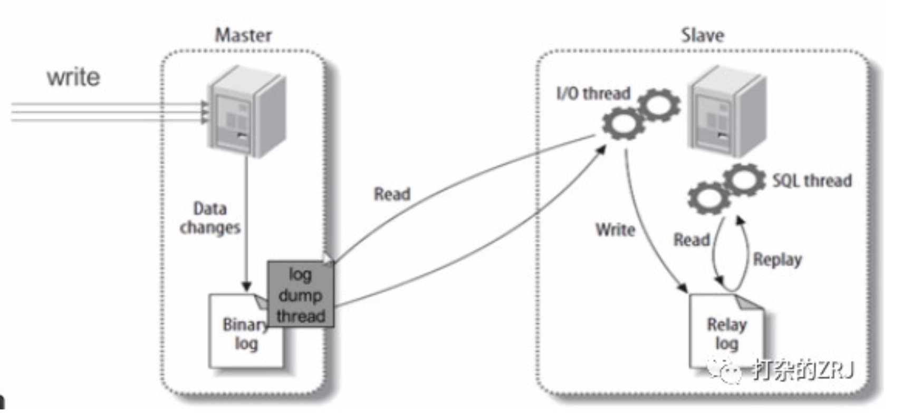

# 数据库优化的几个阶段

> 第一阶段 优化 sql 和索引

因为这一步成本最低啊，不需要加什么中间件。

- (1)用慢查询日志定位执行效率低的 SQL 语句
- (2)用 explain 分析 SQL 的执行计划
- (3)确定问题，采取相应的优化措施，建立索引啊，等

> 第二阶段 搭建缓存

在优化 sql 无法解决问题的情况下，才考虑搭建缓存。毕竟你使用缓存的目的，就是将复杂的、耗时的、不常变的执行结果缓存起来，降低数据库的资源消耗。

这里需要注意的是:搭建缓存后，系统的复杂性增加了。你需要考虑很多问题，比如:

- 缓存和数据库一致性问题？(比如是更缓存，还是删缓存)。
- 缓存击穿、缓存穿透、缓存雪崩问题如何解决？是否有做缓存预热的必要。

> 第三阶段 读写分离

缓存也搞不定的情况下，搞主从复制，上读写分离。在应用层，区分读写请求。或者利用现成的中间件 mycat 或者 altas 等做读写分离。

需要注意的是,只要你敢说你用了主从架构，有三个问题，你要准备:

(1)主从的好处？
回答:实现数据库备份，实现数据库负载均衡，提交数据库可用性

(2)主从的原理?

主库有一个 log dump 线程，将 binlog 传给从库  
从库有两个线程，一个 I/O 线程，一个 SQL 线程，I/O 线程读取主库传过来的 binlog 内容并写入到 relay log,SQL 线程从 relay log 里面读取内容，写入从库的数据库。

(3)如何解决主从一致性?

根据 CAP 定理，主从架构本来就是一种高可用架构，是无法满足一致性的  
哪怕你采用同步复制模式或者半同步复制模式，都是弱一致性，并不是强一致性。所以，推荐还是利用缓存，来解决该问题。  
步骤如下:

- 1、自己通过测试，计算主从延迟时间，建议 mysql 版本为 5.7 以后，因为 mysql 自 5.7 开始，多线程复制功能比较完善，一般能保证延迟在 1s 内。
- 2、数据库的写操作，先写数据库，再写 cache，但是有效期很短，就比主从延时的时间稍微长一点。
- 3、读请求的时候，先读缓存，缓存不存在(这时主从同步已经完成)，再读数据库。

> 第四阶段 利用分区表

很多互联网公司都不建议用分区表，我自己也不太建议用分区表，采用这个分区表，坑太多。

什么是 mysql 的分区表？  
回答：所有数据还在一个表中，但物理存储根据一定的规则放在不同的文件中。这个是 mysql 支持的功能，业务代码不需要改动，但是 sql 语句需要改动，sql 条件需要带上分区的列。

缺点

- (1)分区键设计不太灵活，如果不走分区键，很容易出现全表锁
- (2)在分区表使用 ALTER TABLE … ORDER BY，只能在每个分区内进行 order by。
- (3)分区表的分区键创建索引，那么这个索引也将被分区。分区键没有全局索引一说。
- (4)自己分库分表，自己掌控业务场景与访问模式，可控。分区表，研发写了一个 sql，都不确定该去哪个分区查，不太可控。
  ...不列举了，不推荐

> 第五阶段 垂直拆分

垂直拆分的复杂度还是比水平拆分小的。将你的表，按模块拆分为不同的小表。大家应该都看过《大型网站架构演变之路》，这种类型的文章或者书籍，基本都有提到这一阶段。  
如果你有幸能够在什么运营商、银行等公司上班，你会发现他们一个表，几百个字段都是很常见的事情。所以，应该要进行拆分，拆分原则一般是如下三点:

- (1)把不常用的字段单独放在一张表。
- (2)把常用的字段单独放一张表
- (3)经常组合查询的列放在一张表中（联合索引）。

第六阶段 水平拆分

水平拆分是最麻烦的一个阶段，拆分后会有很多的问题，强调一次，水平拆分一定是最最最最后的选择。从某种意义上，我觉得还不如垂直拆分。因为你用垂直拆分，分成不同模块后，发现单模块的压力过大，你完全可以给该模块单独做优化，例如提高该模块的机器配置等。如果是水平拆分，拆成两张表，代码需要变动，然后发现两张表还不行，再变代码，再拆成三张表的？水平拆分模块间耦合性太强，成本太大，不是特别推荐。
