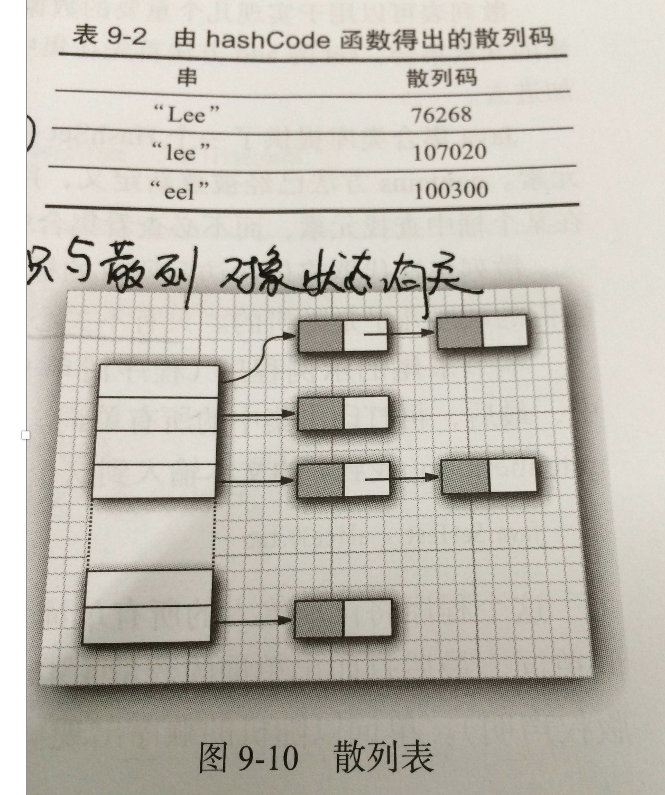

# 散列表

无论是 Set 还是 Map，我们会发现都会有对应的 HashSet,HashMap

数据和链表：

- 链表和数组都可以按照人们的意愿来排列元素的次序，他们可以说是有序的(存储的顺序和取出的顺序是一致的)
- 但同时，这会带来缺点：想要获取某个元素，就要访问所有的元素，直到找到为止。
- 这会让我们消耗很多的时间在里边，遍历访问元素

而还有另外的一些存储结构：不在意元素的顺序，能够快速的查找元素的数据

- 其中就有一种非常常见的：散列表

## 散列表工作原理

散列表为每个对象计算出一个整数，称为散列码。根据这些计算出来的整数(散列码)保存在对应的位置上！

在 Java 中，散列表用的是链表数组实现的，每个列表称之为桶。

一个桶上可能会遇到被占用的情况(hashCode 散列码相同，就存储在同一个位置上)，这种情况是无法避免的，这种现象称之为：散列冲突

- 此时需要用该对象与桶上的对象进行比较，看看该对象是否存在桶子上了~如果存在，就不添加了，如果不存在则添加到桶子上
- 当然了，如果 hashcode 函数设计得足够好，桶的数目也足够，这种比较是很少的~
- 在 JDK1.8 中，桶满时会从链表变成平衡二叉树

如果散列表太满，是需要对散列表再散列，创建一个桶数更多的散列表，并将原有的元素插入到新表中，丢弃原来的表

- 装填因子(load factor)决定了何时对散列表再散列~
- 装填因子默认为 0.75，如果表中超过了 75%的位置已经填入了元素，那么这个表就会用双倍的桶数自动进行再散列
