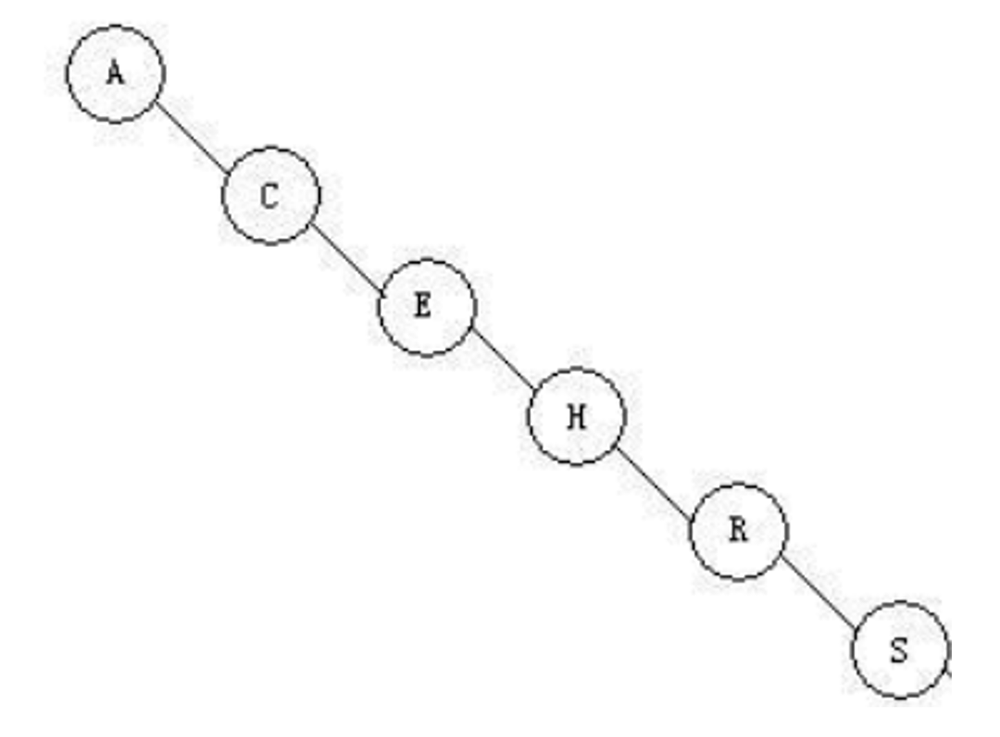
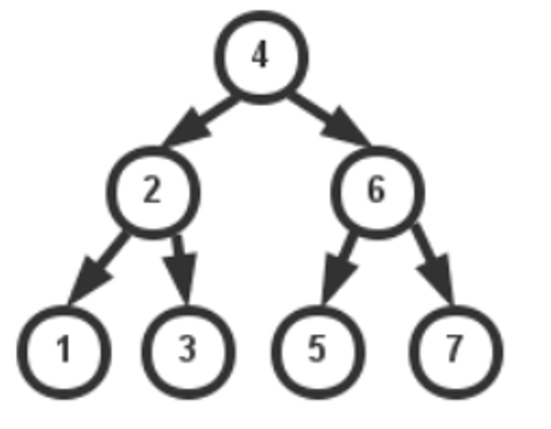
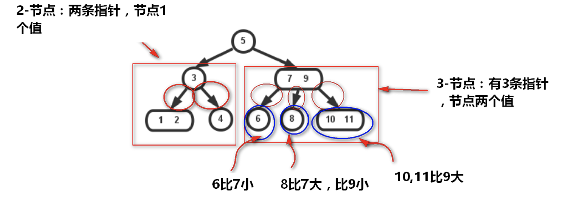
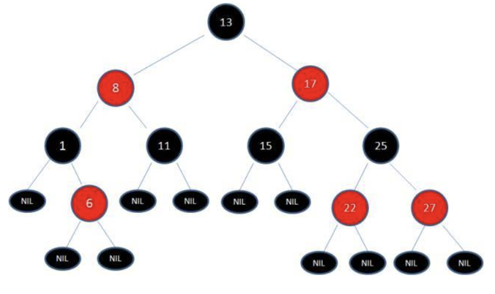

# 红黑树

## 回顾二叉查找树

利用二叉查找树的特性，我们一般来说可以很快地查找出对应的元素。  
可是二叉查找树也有个例(最坏)的情况(线性)：

上面符合二叉树的特性，但是它是线性的，完全没树的用处  
树是要“均衡”才能将它的优点展示出来的，比如下面这种：

因此，就有了平衡树这么一个概念~红黑树就是一种平衡树，它可以保证二叉树基本符合矮矮胖胖(均衡)的结构

## 2-3 树

在二叉查找树上，我们插入节点的过程是这样的：小于节点值往右继续与左子节点比，大于则继续与右子节点比，直到某节点左或右子节点为空，把值插入进去。这样无法避免偏向问题

而 2-3 树不一样：它插入的时候可以保持树的平衡！  
在 2-3 树插入的时可以简单总结为两个操作：

- 合并 2-节点为 3-节点，扩充将 3-节点扩充为一个 4-节点
- 分解 4-节点为 3-节点，节点 3-节点为 2-节点
- ........至使得树平衡

## 从 2-3 树到红黑树

由于 2-3 树为了保持平衡性，在维护的时候是需要大量的节点交换的！这些变换在实际代码中是很复杂的，在 2-3 树的理论基础上发明了红黑树

红黑树是一种平衡二叉树

红黑树就字面上的意思，有红色的节点，有黑色的节点：

## 红黑树基础知识

那红黑树是以什么的方式来保持树的平衡的呢？

红黑树用的是也是两种方式来替代 2-3 树不断的节点交换操作：

- 旋转：顺时针旋转和逆时针旋转
- 反色：交换红黑的颜色
- 这个两个实现比 2-3 树交换的节点(合并，分解)要方便一些

红黑树为了保持平衡，还有制定一些约束，遵守这些约束的才能叫做红黑树：

- 红黑树是二叉搜索树。
- 根节点是黑色。
- 每个叶子节点都是黑色的空节点（NIL 节点）。
- 每个红色节点的两个子节点都是黑色。(从每个叶子到根的所有路径上不能有两个连续的红色节点)
- 从任一节点到其每个叶子的所有路径都包含相同数目的黑色节点(每一条树链上的黑色节点数量（称之为“黑高”）必须相等)。
