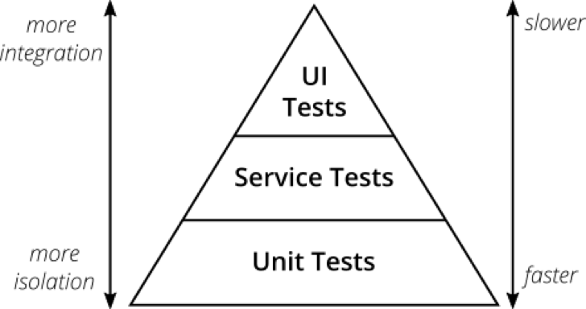

# 测试金字塔

> 是什么

“测试金字塔”是一个比喻，它告诉我们要把软件测试按照不同粒度来分组。它也告诉我们每个组应该有多少测试。

> 为什么

如果你想跟上时代的步伐，你必须研究如何在不牺牲质量的情况下更快地交付你的软件。持续交付——一种高度自动化的、确保你可以随时将软件发布到生产环境中的实践——正能帮你达到这个目的。它通过构建流水线自动测试你的软件，自动将其部署到测试和生产环境中。  
软件的数量正以前所未有的速度增长，手动进行构建、测试和部署，很快就会变得不可能——除非你想把所有的时间都用来进行手动重复的工作，而不是用来开发可工作的软件。将一切自动化，从构建到测试，从部署到基础架构，这是你唯一的出路。

> 测试金字塔

根据 Mike Cohn 的测试金字塔，你的测试组合应该由以下三层组成（自下往上分别是）：

- 单元测试
- 服务测试
- 用户界面测试

然而，由于其简洁性，在建立你自己的测试组合时，测试金字塔本身是一条很好的经验法则。记住测试金字塔中提到的两件事：

- 编写不同粒度的测试
- 层次越高，你写的测试应该越少

> 原则

为了维持金字塔形状，一个健康、快速、可维护的测试组合应该是这样的：写许多小而快的单元测试。适当写一些更粗粒度的测试，写很少高层次的端到端测试。

> 工具和库

- Unit : 测试执行库
- Mockito: 模拟依赖
- Wiremock: 为外部服务打桩
- Pact: 用于编写消费者驱动的契约测试
- Cypress: 用于编写用户界面驱动的端到端测试

> 测试结构

一个好的测试结构（不局限于单元测试）是这样的：

- 准备测试数据
- 调用被测方法
- 断言返回的是你期待的结果

这里有个口诀可以帮你记住这种结构：“Arrange，Act，Assert”。另一个口诀则是“given”，“when”，“then”三件套，given 说的是准备数据，when 指的是调用方法，then 则是断言。

## 单元测试

---

> 是什么？

单元测试将成为你测试组合的基石。你的单元测试保证了代码库里的某个单元（被测试的主体）能按照预期那样工作。单元测试在你的测试组合里测试的范围是最窄的。它的数量在测试组合中应该远远多于其他类型的测试。

> 一个单元指的是什么？

如果你正在使用函数式语言，一个单元最有可能指的是一个函数。你的单元测试将使用不同的参数调用这个函数，并断言它返回了期待的结果。在面向对象语言里，下至一个方法，上至一个类都可以是一个单元（从一个单一的方法到一整个的类都可以是一个单元）。

> 应该测试什么？

保证代码所有的路径都被测试到（包括正常路径和边缘路径）。同时它们不应该和代码的实现有太紧密的耦合。  
测试公共接口。但是更重要的是，不要去测试微不足道的代码。

## 服务测试（集成测试/组件测试）

---

> 组件测试是什么？

组件是在大型系统中封装良好的、可独立替换的中间子系统。对这样的组件进行单独的测试有很多好处，通过将测试范围限制在组件之内，就能在对组件所封装的行为进行验收测试的同时，维持相较于高层测试更好的执行效率。在微服务架构中，组件也就是服务本身。

> 集成测试是什么?

每次只测试一个集成点。测试时应使用测试替身来替代其他的外部服务、数据库等。同时，使用契约测试对测试替身和真实实现进行覆盖。这样出来的集成测试更快，更独立，更易理解和调试。

> 优点

在测试金字塔中，集成测试的层级比单元测试更高。集成缓慢的外部依赖（如文件系统或数据库等）通常比隔离了这些依赖的单元测试需要更长时间。他们可能比小型并且独立的单元测试难写，毕竟你需要让外部依赖在你的测试中运行起来。然而，它的优势在于建立了你对应用能正确访问外部依赖的自信，这是单纯的单元测试做不到的。

## 契约测试

---

> 是什么?

每一个接口都有提供方（或者发布者）和消费方（或者订阅者）实体。接口之间的规范可以视为是一个契约。

> 作用

契约测试保证了提供方和所有的消费方基于同一个定义好的接口契约。用 CDC 测试，消费者就可以通过自动化测试发布他们的需求，提供方则可以持续不断获取这些测试并执行

如果你的组织正在践行微服务，那么拥有 CDC 测试将是迈向自治团队的一大步。CDC 测试是一种促进团队交流的自动化途径。它们保证了团队间的接口能一直如期工作。如果有 CDC 测试挂掉，则可能是个好的信号，意味着你应该走过去到那个被测试影响的团队，了解他们最近是否有 API 变更，弄清楚你们希望如何处理这些变更。

> 流程

- 消费方团队根据他们期待的结果编写自动化测试
- 发布自动化测试给提供方团队
- 提供方持续不断地运行这些测试，并保持他们都能通过
- 如果 CDC 测试挂掉了，则需要双方进行沟通

## UI 测试

---

应用中的用户界面是否如预期工作

## 端到端测试

---

通过用户界面测试一个已部署好的应用

谨记：在测试金字塔里，有很多更低层级的测试，这些测试已经全面测试了各种边缘情况及与其他系统的集成。不需要再在高层级测试里重复测一遍。否则，高维护成本和一堆谎报错误将会降低开发速度，迟早会让你对测试失去信心。

## Tip

---

- 把测试放到你的部署流水线上  
  如果你正在践行持续集成或者持续交付的实践，那么你会有一条部署流水线来在每一次提交改动时运行自动化测试。通常这个流水线会被分成几个阶段，它们会逐步建立起让你把软件部署到生产环境的自信。听了这么多不同类型的测试，你可能想进一步了解它们在部署流水线中应如何放置。要回答这个答案，你需要思考一下持续交付（实际上是极限编程和敏捷软件开发的核心价值观之一）的其中一项核心价值观：快速反馈。

- 避免测试重复  
  金字塔不同层级进行了重复测试。虽然你本能会说测试太多没啥问题，但我向你保证，会有问题。测试组合中每一个测试都有一定的成本，它们不是免费的。编写和维护测试都要花费时间。阅读和理解其他人写的测试也要花时间。当然，运行这些测试也要费时间。
- 三条原则
  - 如果一个更高层级的测试发现了一个错误，并且底层测试全
    都通过了，那么你应该写一个低层级测试去覆盖这个错误
  - 竭尽所能把测试往金字塔下层赶。
  - 整洁测试代码。
