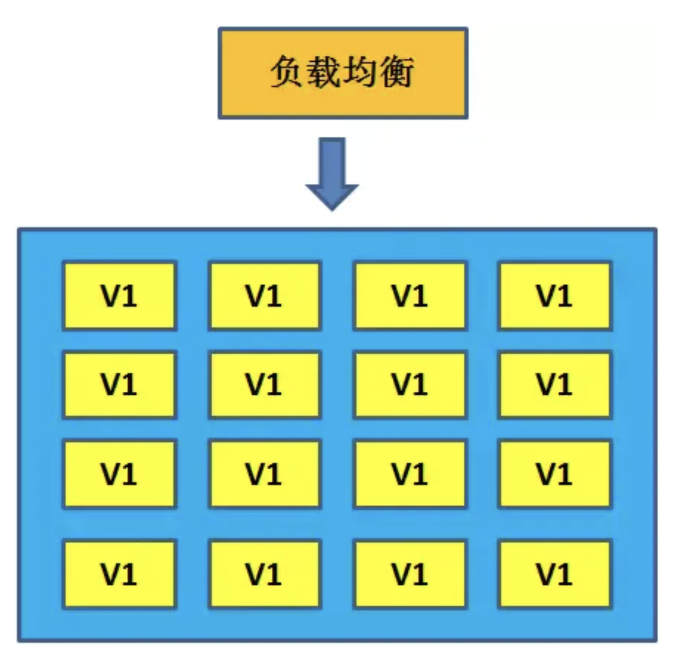

# 不间断部署方式

## 蓝绿部署

蓝绿部署，英文名 Blue Green Deployment，是一种可以保证系统在不间断提供服务的情况下上线的部署方式。

在没有上线的正常情况下，集群 A 和集群 B 的代码版本是一致的，并且同时对外提供服务。

在系统升级的时候下，我们首先把一个集群（比如集群 A）从负载列表中摘除，进行新版本的部署。集群 B 仍然继续提供服务。

当集群 A 升级完毕，我们把负载均衡重新指向集群 A，再把集群 B 从负载列表中摘除，进行新版本的部署。集群 A 重新提供服务。

最后，当集群 B 也升级完成，我们把集群 B 也恢复到负载列表当中。这个时候，两个集群的版本都已经升级，并且对外的服务几乎没有间断过。

## 滚动部署

滚动部署，英文 Rolling update，同样是一种可以保证系统在不间断提供服务的情况下上线的部署方式。

和蓝绿部署不同的是，滚动部署对外提供服务的版本并不是非此即彼，而是在更细的粒度下平滑完成版本的升级。

滚动部署只需要一个集群，集群下的不同节点可以独立进行版本升级。比如在一个 16 节点的集群中，我们选择每次升级 4 个节点：

以此类推，最终所有的节点都升级了版本。

## 两种部署方式比较

